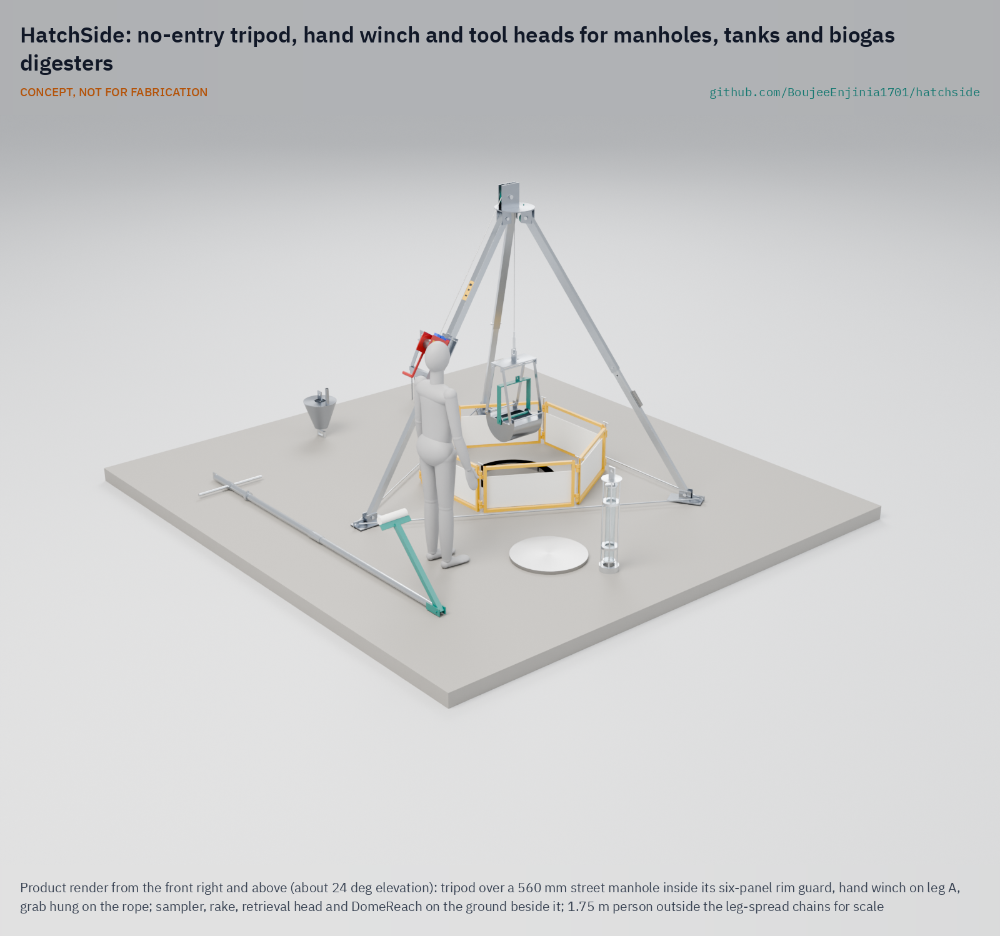

# HatchSide

     

**Area:** Situational field hardware · **TRL:** 3 of 9 (proof of concept on paper; constructable design) · **Value-engineering target:** USD 5,000; estimated cost USD 2,838 · **Difficulty:** 3 of 5

Lets crews clean, sample and retrieve through a manhole or tank hatch from a tripod, so nobody enters; includes the DomeReach tool head for household biogas digesters.

## Concept rationale

The safest confined-space entry is the one that never happens. HatchSide sets a portable tripod and mast over a manhole or tank hatch, and the crew lowers interchangeable tool heads on a hand winch: a grab, a sampler, a rake, a retrieval head and the DomeReach head for household biogas digesters. Each head is worked from outside, so the job gets done with everyone above ground.

Keeping it open and hand-powered matters because the people dying in these spaces are informal sanitation workers, farm families and small contractors who cannot afford powered robots or commercial rescue kits. Commercial tripods are built for lowering a person in, not for keeping people out. A single open frame with many heads can be built from standard tube and a commodity winch, and each new head adds a task that no longer needs entry.

## Burning platform

India's government reported 498 deaths from hazardous sewer and septic tank cleaning between January 2019 and June 2026 ([Business Standard, 2026](https://www.business-standard.com/india-news/sanitation-workers-sewer-septic-tank-cleaning-deaths-since-2019-126080500881_1.html)). A government social audit of 54 of these deaths found that 49 of the workers wore no safety equipment at all ([The Wire, 2025](https://m.thewire.in/article/rights/more-than-90-workers-who-died-while-cleaning-sewers-didnt-have-safety-gears-govt)). In the United States, 1,030 workers died in confined-space incidents from 2011 to 2018 ([BLS](https://www.bls.gov/iif/factsheets/fatal-occupational-injuries-confined-spaces-2011-19.htm)).

Rescue attempts multiply the toll. NIOSH found that more than 60 % of confined-space deaths are would-be rescuers ([NIOSH 86-110](https://ncsp.tamu.edu/reports/CDC/Confined%20Spaces%20Alert-DHHS%20(NIOSH)%20Publication%20No_%2086-110.htm)). Household biogas carries the same risk: a 2024 review counted 163 biogas safety incidents in seven Asian countries from 1958 to 2023, with 321 deaths ([Ni, 2024](https://ideas.repec.org/a/eee/rensus/v197y2024ics1364032124000947.html)), and digester maintenance guidance says work should be done from above ground wherever possible ([energypedia](https://energypedia.info/wiki/Maintenance_of_a_Biogas_Plant)).

## Where it could be used

### By industry

| Industry | Use |
| --- | --- |
| Municipal sanitation and sewer maintenance | Desilting manholes and retrieving blockages without entry |
| Septic tank and faecal sludge services | Breaking scum, sampling sludge depth and retrieving objects |
| Agriculture and household biogas | DomeReach head for servicing and resealing fixed-dome digesters from the opening |
| Oil and gas | Sampling and retrieving from frac tanks and produced-water tanks through the hatch |
| Chemicals and tank cleaning | Sampling and loosening residues in tanks and tankers before any entry decision |
| Emergency services | Retrieval head that clips onto a person already on a line, for a haul with certified rescue equipment |

### By country or region

| Country or region | Why it matters there |
| --- | --- |
| India | 498 sewer and septic tank cleaning deaths from 2019 to mid-2026 ([Business Standard, 2026](https://www.business-standard.com/india-news/sanitation-workers-sewer-septic-tank-cleaning-deaths-since-2019-126080500881_1.html)), with 49 of 54 audited victims wearing no safety gear ([The Wire, 2025](https://m.thewire.in/article/rights/more-than-90-workers-who-died-while-cleaning-sewers-didnt-have-safety-gears-govt)). |
| United States | 1,030 confined-space deaths from 2011 to 2018 ([BLS](https://www.bls.gov/iif/factsheets/fatal-occupational-injuries-confined-spaces-2011-19.htm)); a Houston-area tank cleaning contractor had two workers die in 2019 and another in 2023 ([OSHA, 2024](https://www.osha.gov/news/newsreleases/region6/07082024)). |
| Asia (household and farm biogas) | 163 biogas safety incidents and 321 deaths recorded across seven Asian countries from 1958 to 2023 ([Ni, 2024](https://ideas.repec.org/a/eee/rensus/v197y2024ics1364032124000947.html)). |
| Rural India (household pits) | In March 2026 four members of one family in Vaishali, Bihar, died one after another after entering a soak pit ([The Hawk, 2026](https://www.thehawk.in/news/india/family-of-four-suffocate-to-death-in-bihars-vaishali)). |

## What sparked the idea

The idea goes back to a NIOSH investigation in a West Virginia gas field. A rig hand collapsed inside a fracturing tank holding gas, water, acid and oil; co-workers went in after him, survivors said they were overcome by the gas within 10 to 15 seconds of entry, and two of the rescuers died ([NIOSH FACE 85-02](https://stacks.cdc.gov/view/cdc/164612)). The same story repeats in Indian sewers and household pits today. HatchSide starts from that lesson: if the work and the retrieval can be done from the hatch, nobody needs to go in, and nobody needs to go in after them.

## Problem

Workers still climb into sewers, septic tanks, industrial tanks and biogas digesters to clean, sample or recover things, and they die from gas and lack of oxygen. Too often the people who go in after them die too.

Full problem statement: [docs/01-problem.md](docs/01-problem.md)

## Concept

A portable tripod with a hand winch and interchangeable tool heads (grab, sampler, rake, retrieval head and the DomeReach biogas head) set up over a manhole or tank hatch; the crew lowers and works each head from outside, so nobody enters the space.

Full design precis: [docs/02-concept.md](docs/02-concept.md) · Requirements: [docs/03-requirements.md](docs/03-requirements.md) · Calculations: [docs/04-calcs/01-sizing.md](docs/04-calcs/01-sizing.md) · Prototype build plan: [docs/05-build-plan.md](docs/05-build-plan.md) · Design decisions: [docs/06-design-decisions.md](docs/06-design-decisions.md) · General arrangement: [cad/drawings/HTS-DWG-001.pdf](cad/drawings/HTS-DWG-001.pdf) · 3D viewer: [media/viewer.html](media/viewer.html)

## Key components

| BOM | Component |
| --- | --- |
| 1 to 8 | Tripod: steel feet and chains, telescoping square aluminium legs, steel head with mast cheeks and a 150 mm sheave |
| 9 to 12 | Two-speed hand winch with automatic load brake on a bracket on leg A; 15 m of 6 mm stainless rope; line counter |
| 13 | Standard head interface: swivel, screw-pin shackle and a 10 mm tab with a 20 mm hole on every head |
| 14 | Snatch block, working line and cleat for closing the grab and dragging the rake |
| 15, 16 | Six-panel rim guard with drop pins |
| 17 to 21 | Grab, sampler, rake, retrieval head and DomeReach |

Safe working load 150 kg for tool heads; sheave 2.41 m up; feet on a 3.0 m circle; no packed load over 25 kg; every head passes a 560 mm manhole. Concept, not for fabrication.

## Building the prototype

The [prototype build plan](docs/05-build-plan.md) shows how to make each component and put the kit together, with a making sketch for every made part, close-ups of the ten joints and a picture for each of the 14 assembly steps. The steel head, feet, bracket and heads are cut, welded and then hot-dip galvanized; the legs and guard are sawn and drilled aluminium; the winch, rope, sheave and fittings are bought. It is a plan, not yet built, and it ends in safety stops, including a proof load to 1.5 times the safe working load before any use over an opening.

## Safety

> Safety-critical: involves lifting and confined spaces. Published as an open engineering reference, never as certified rescue, lifting or fall-protection equipment.
>
> Never enter the space. The kit exists so that nobody has to. The winch is a material winch: never use it to lift or lower a person.
>
> The retrieval head only clips a connector onto a line already on a casualty. The haul is made with certified rescue equipment by a trained rescue team.
>
> Proof-load the tripod, winch and rope to 1.5 times the safe working load with a competent person before first use over an opening.
>
> Test the air at the opening with a certified gas detector before and during work; gas can escape at the rim.
>
> Keep sparks and flames away from biogas digesters and sewers; methane can ignite.
>
> Guard the open hatch from traffic and falls, and never stand under a raised load.
>
> This design is published as an open engineering reference. It is not certified equipment. Concept, not for fabrication.

## Repository layout

| Folder | Contents |
| --- | --- |
| `docs/` | Problem, concept, requirements, calculations and design decisions |
| `cad/src/` | build123d Python source, the source of truth for all geometry |
| `cad/step/`, `cad/stl/` | Exported models for FreeCAD, other CAD tools and printing |
| `cad/drawings/` | 2D sketches and dimensioned drawings |
| `bom/` | Bill of materials |
| `electronics/` | KiCad schematics and PCB layouts |
| `firmware/` | Microcontroller code |
| `media/` | Renders, perspectives and photos |
| `build-log/` | Dated prototyping notes |

## Documentation

Controlled documents follow the portfolio [documentation standard](.kit/STANDARDS.md). Each carries a document ID (HTS-PRC-001 for the precis), a version and a revision history. Branded PDFs are built with `python .kit/render.py` and attached to GitHub Releases when a document is tagged, for example `HTS-PRC-001/v1.0`.

## Credits

Designed by Amish Chadha at Design Molecule Labs. See [CONTRIBUTORS.md](CONTRIBUTORS.md) for roles. To cite this design, use [CITATION.cff](CITATION.cff) (GitHub shows it as "Cite this repository").

AI assistance (Claude) was used to accelerate prototype documentation and first-pass research. Design direction and all decisions are Amish Chadha's, recorded in this repository's decision records (`docs/decisions/`).

## Licenses

- **Hardware** (CAD, drawings, BOM, electronics): [CERN-OHL-S v2](LICENSE)
- **Software** (firmware, scripts, notebooks): [MIT](LICENSE-SOFTWARE)

A project of the [Design Molecule](https://designmolecule.com) lab.
