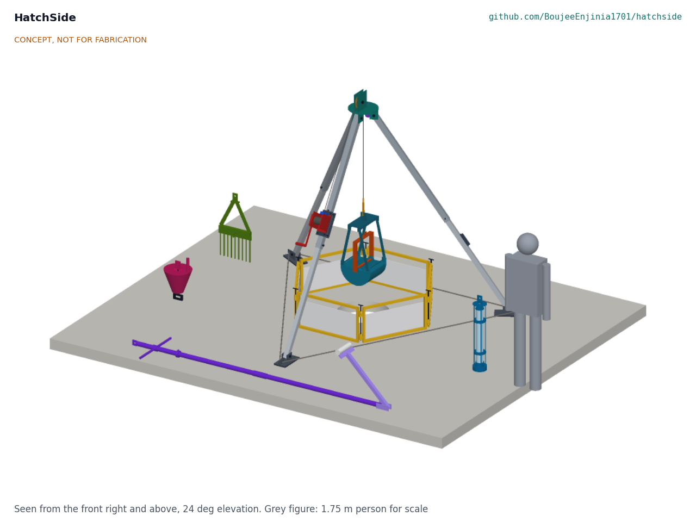
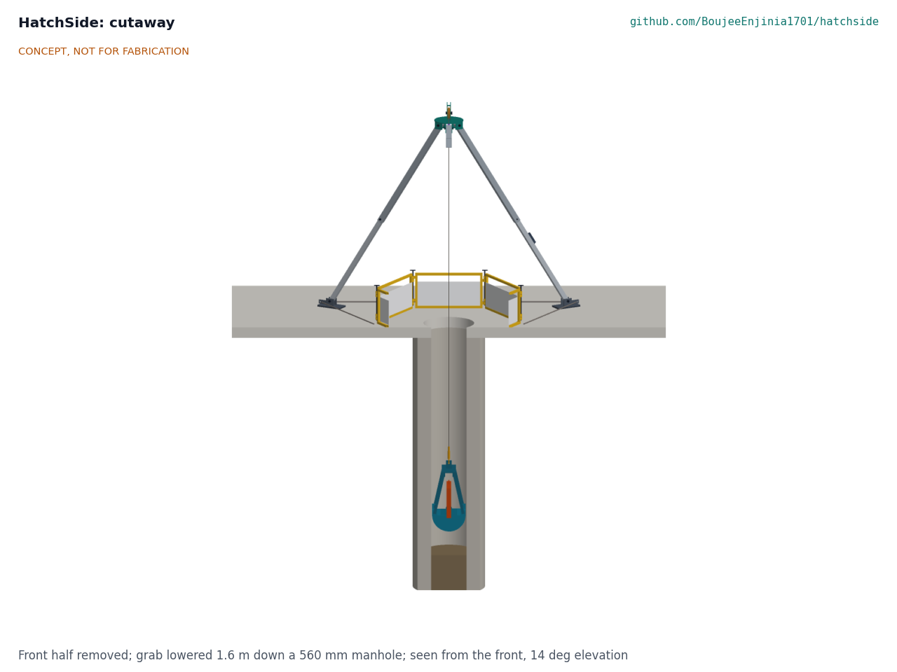
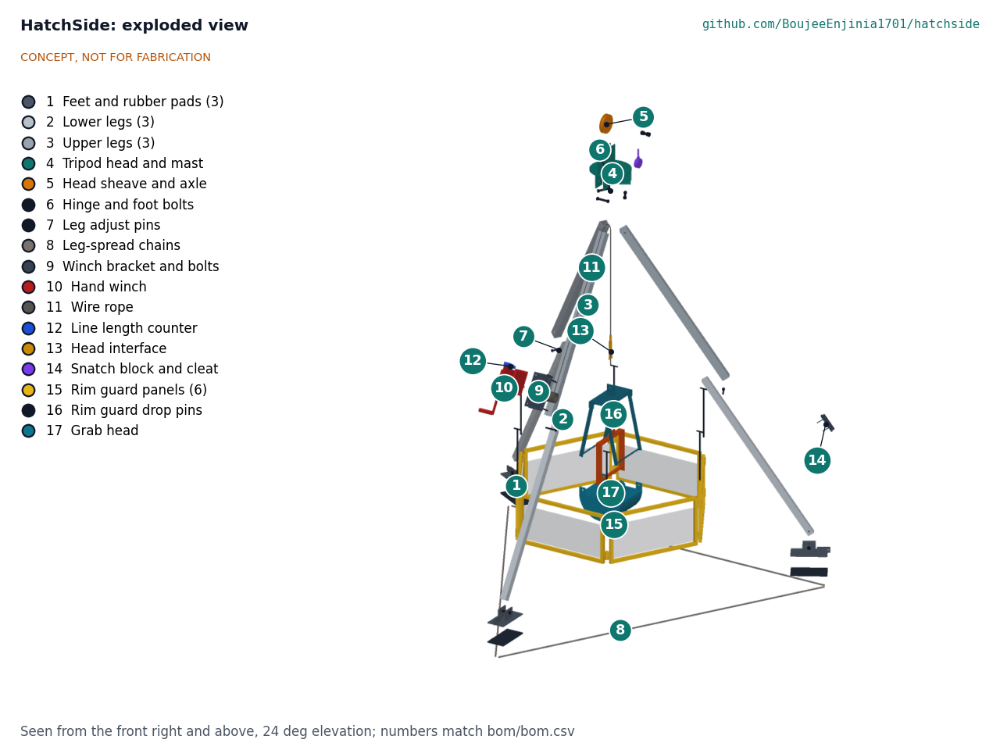
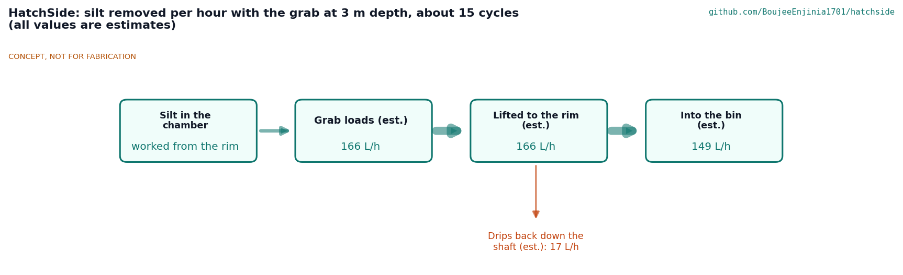

# HatchSide design precis

Lets crews clean, sample and retrieve through a manhole or tank hatch from a tripod, so nobody enters; includes the DomeReach tool head for household biogas digesters.

*Figure 1. HatchSide set up over a 560 mm street manhole inside its rim guard, with the grab on the rope and the other four heads on the ground; grey figure 1.75 m for scale. Concept, not for fabrication.*

## How it works

The crew cones off the site, lifts the cover and stands a three-legged aluminium tripod over the opening. The legs are already bolted to a steel head plate; each telescopes and locks with a ball-lock pin, and three chains between the feet stop them spreading. A two-speed hand winch with an automatic load brake is clamped to leg A. Its 6 mm stainless rope runs up beside leg A, over a 150 mm sheave held between two steel cheek plates on the head, and drops straight down the centre of the opening. On the rope's end a swivel and a screw-pin shackle take any of five tool heads, all of which carry the same 10 mm steel tab with a 20 mm hole.

- **Grab:** a clamshell that is lowered open and closed by a working line led through a snatch block under the head and tied off on a cleat on leg B; it lifts about 10.8 L of wet silt per cycle (estimate).
- **Sampler:** a clear tube in a ballasted cage, with caps tripped shut at a chosen depth read from a line counter.
- **Rake:** a ballasted tine bar dragged through scum or a blockage by the working line.
- **Retrieval head:** a funnel steered by a pole so its auto-locking connector clips onto a line already on a casualty; the haul is made with certified rescue equipment.
- **DomeReach:** a two-section pole with a single hinged arm worked by a pull line, for breaking scum, lifting sludge and rolling generic sealant inside a household biogas digester from its opening.

Six hinged panels pinned into a hexagon round the opening keep people and traffic out and splash in. Every job is done with the crew standing outside the guard.

*Figure 2. Cutaway with the front half removed: the grab lowered 1.6 m down the manhole shaft. Concept, not for fabrication.*

## Components

*Table 1. Main components (numbers match `bom/bom.csv` and Figure 3).*

| BOM | Component | Role |
| --- | --- | --- |
| 1 | Feet with clevis, chain lug and rubber pad (3) | Bear on the street and anchor the chains |
| 2, 3 | Lower and upper legs, square aluminium tube (3 each) | Telescoping legs, 2,585 mm pin to pin at normal length |
| 4 | Tripod head with mast cheeks | Hinges the legs and carries the sheave |
| 5 | Head sheave and M20 axle | Turns the rope down the centre line |
| 6, 7 | Hinge and foot bolts, adjust pins | Join the legs to the head and feet; set leg length |
| 8 | Leg-spread chains (3) | Stop the feet spreading |
| 9, 10 | Winch bracket and hand winch | Raise and lower heads; the brake holds the load |
| 11, 12 | Wire rope and line counter | 15 m of rope; depth read to 0.1 m |
| 13 | Head interface (swivel, shackle, gauge plate) | The one published coupling for every head |
| 14 | Snatch block, working line and cleat | Close the grab, drag the rake, trip the sampler |
| 15, 16 | Rim guard panels and drop pins | Barrier and splash guard round the opening |
| 17 to 21 | Grab, sampler, rake, retrieval and DomeReach heads | The five tasks |
| 22 to 24 | Cones and chain, carry bags, labels | Work zone, transport, markings |

*Figure 3. Exploded view with BOM numbers. Concept, not for fabrication.*

## Key design choices

All decided by Amish under his 2026-10-03 pre-approval (HTS-DDR-001 and HTS-DDR-002; index in HTS-DEC-001).

- **Material handling only, 150 kg.** The frame is rated for tool heads, not people. This keeps every pack under 25 kg and keeps the design out of personnel-rescue certification.
- **No separate mast.** The sheave sits between two cheek plates welded to the head plate, at the height where the rope from the winch runs parallel to leg A. One welded part replaces a mast, its joint and its bracing.
- **Positive winch load path.** The winch bracket clamps round leg A but bears on a through stop bolt, so the rope pull never relies on friction on aluminium.
- **One head interface.** A 10 mm tab with a 20 mm hole 30 mm below its top edge. Anyone can make a new head that fits.
- **Hand power and single hinges.** No engine, no powered arm and no gripper; the grab and DomeReach are worked by lines from the rim (patent design-around for articulated grippers).
- **Galvanized steel, 6082 aluminium and A4 stainless,** with nylon isolation between steel and aluminium.

## First-order numbers

From HTS-CAL-001 (estimates; nothing measured).

*Table 2. First-order numbers.*

| Quantity | Value | Assumption |
| --- | --- | --- |
| Sheave height above ground | 2.41 m | Legs at 32.5 degrees, feet on a 3.0 m circle |
| Leg force, winch leg, at 150 kg x 1.5 x 1.25 | 3.85 kN | Rope runs along leg A |
| Leg buckling margin | 5.5 | Whole leg as the 50 x 3 mm section |
| Rope safety factor at 150 kg | 14.3 | 21 kN minimum breaking load |
| Tipping angle of the rope at 150 kg | 25 degrees | 71.4 kg tripod, 750 mm to the tipping edge |
| Crank force at 150 kg, low gear | 31 N | 10:1, 250 mm crank, 75 % efficiency |
| Grab payload per cycle | 10.8 L (19 kg) | 70 % fill, 1.8 kg/L |
| Silt removed per hour at 3 m | About 166 L | 3.9 minutes a cycle |
| Heaviest packed load | 23.7 kg | Grab head |
| Setup time, two people | 9.0 minutes | Legs travel bolted to the head |
| Estimated parts cost | USD 2,838 | `bom/bom.csv` |

Value-engineering target: USD 5,000. Estimated cost of the constructable design: USD 2,838 (USD 2,162 under the target).

*Figure 4. Silt removed per hour with the grab at 3 m depth (all values are estimates).*

## Patent design-arounds

From the preliminary patent, trademark and prior-art screen (not legal advice):

- No articulated arm with a multi-finger gripper (Genrobotics Bandicoot patents); DomeReach has one hinge and no gripper.
- The name TopSide was dropped because of a generic mark and the US Navy TOPSIDE C3 mark; HatchSide is used instead.
- DomeReach names its sealant generically, never by brand.
- If the tethered crawler block is later adopted, it uses a generic published head interface (connector plus bolts), no adjustable crawler legs and a simple payout encoder, per the 2026-09-30 screen.

## Shared blocks

- Tripod and mast block: at 150 kg it is not shared with WellSling, whose 400 to 600 kg loads need their own frame (HTS-DDR-001, D1).
- CalRig proof-load (winch, rope and tripod proof testing) at TRL 4.
- Tethered crawler block with CulvertCrawl and VoidScope, if adopted later.

## Safety

> **Safety:** Safety-critical: HatchSide lifts loads over confined spaces. It is published as an open engineering reference, never as certified rescue, lifting or fall-protection equipment.
>
> - Never enter the space. The kit exists so that nobody has to. The winch is a material winch: never use it to lift or lower a person.
> - The retrieval head only clips a connector onto a line already on a casualty. The haul is made with certified rescue equipment by trained rescuers.
> - Test the air at the opening with a certified gas detector before and during work; gas can escape at the rim.
> - Keep sparks and flames away from sewers and biogas digesters; methane can ignite.
> - Guard the open hatch from traffic and falls, keep the rope within 10 degrees of vertical, and never stand under a raised load.
> - Proof-load the tripod, winch and rope to 1.5 times the safe working load with a competent person before first use over an opening.
>
> This design is not certified equipment.

## Where to go next

- Prototype build plan: [05-build-plan.md](05-build-plan.md) (HTS-BLD-001).
- Design decisions register: [06-design-decisions.md](06-design-decisions.md) (HTS-DEC-001).
- Calculations: [04-calcs/01-sizing.md](04-calcs/01-sizing.md) (HTS-CAL-001).
